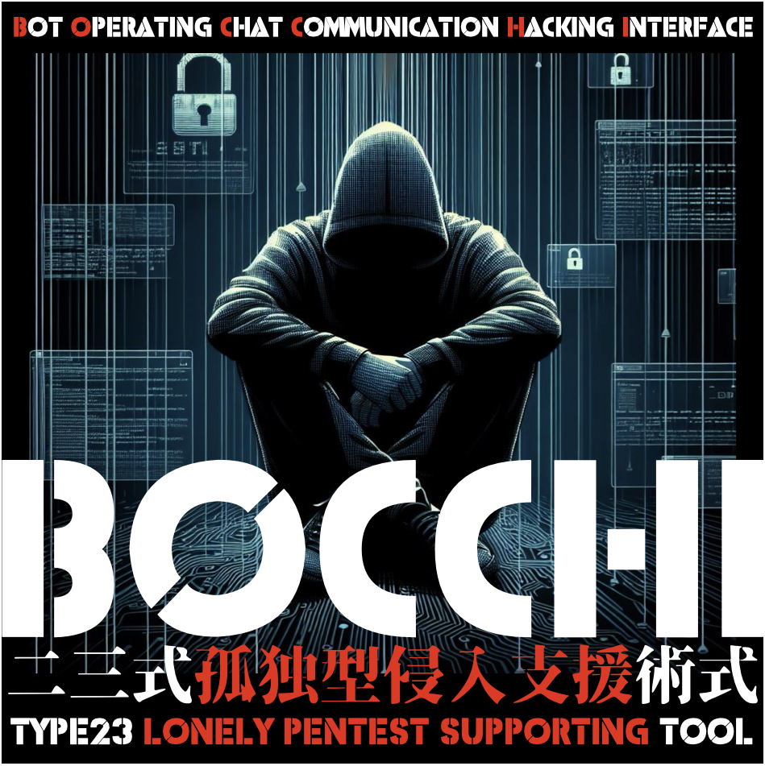

# BOCCHI : Bot Operating Chat Communication Hacking Interface

## Overview
BOCCHI is a chatbot designed for Mattermost, allowing users to conduct reconnaissance activities (port scanning, service scanning), vulnerability assessment, and authentication attempts through chat-based interactions. For instance, instruct BOCCHI with "Scan the [IP address]," and it will automatically perform a port scan using the nmap command, importing the results into Faraday.

## Usage
Interactions with BOCCHI occur through chat commands, making it accessible for those less comfortable with keyboard or command-line inputs. Smartphone users can leverage flick input, making penetration testing feasible with Mattermost installed. While user-friendly, the tool prioritizes safety. It operates only on specified IP addresses and requires user approval before initiating processes.

## Security Considerations
BOCCHI is designed with security in mind, ensuring it doesn't operate on unspecified IP addresses. It also incorporates a user approval step before processing designated addresses.

## Team Collaboration
Utilizing Mattermost, BOCCHI enhances communication among team members, bridging gaps between those skilled in command operations and those less familiar. This fosters better collaboration within the team.

## Future Developments
BOCCHI currently responds to predefined commands and is on its way to supporting natural language conversations using ChatGPT. While considering ChatGPT's API, efforts are being made to ensure functionality without internet connectivity.

## Feedback and Suggestions
Feedback and suggestions for improving BOCCHI's features are highly encouraged. Whether proposing new functions or suggesting enhancements, user input is invaluable. BOCCHI was created to cater to user preferences, making penetration testing more user-friendly and adaptable to individual needs.

---

# BOCCHI - Bot Operating Chat Communication Hacking Interface

## 概要
BOCCHIは、Mattermost向けに設計されたチャットボットで、チャットを通じて偵察活動（ポートスキャン、サービススキャン）、脆弱性評価、認証試行などが可能です。例えば、「 【IPアドレス】をスキャンして」とBOCCHIに指示すると、nmapコマンドを使用してポートスキャンを自動的に行い、結果をFaradayにインポートします。

## 使用方法
BOCCHIとの対話はチャットコマンドを通じて行われるため、キーボードやコマンドラインの使用が苦手なユーザーにもアクセスしやすいです。スマートフォンユーザーはMattermostをインストールすることで、フリック入力を使用して簡単にペネトレーションテストが可能です。使いやすさを重視しつつ、安全性も確保しています。指定されていないIPアドレスに対しては動作せず、処理を始める前にユーザーの承認が必要です。

## 安全性への考慮
BOCCHIはセキュリティを考慮して設計されており、指定されていないIPアドレスに対しては動作しません。また、指定されたアドレスに対しても処理を始める前にユーザーの承認を得る手順が組み込まれています。

## チームコラボレーション
Mattermostを活用することで、BOCCHIはチームメンバー間のコミュニケーションを強化し、コマンド操作に慣れている人とそうでない人との溝を埋めます。これにより、チーム内の連携が向上します。

## 今後の展望
BOCCHIは現在定義済みのコマンドに応じて動作しますが、ChatGPTを使用した自然な会話にも対応する方向に進化しています。また、ChatGPTのAPIを検討していますが、インターネット接続なしでも利用可能な状態も目指しています。

## フィードバックと提案
BOCCHIの機能向上に向けたフィードバックや提案は大歓迎です。新しい機能の提案や改善点についてどしどしご意見ください。BOCCHIはユーザーの要望に応じて生まれたペネトレーションテストツールです。