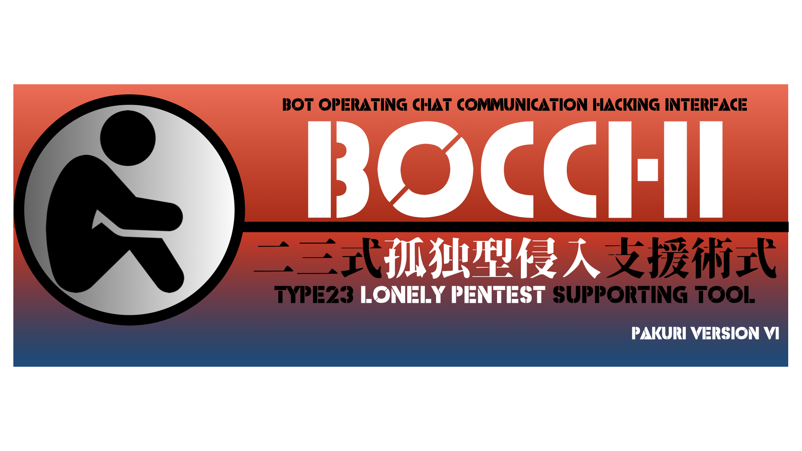

# BOCCHI : Bot Operating Chat Communication Hacking Interface

## BOCCHIとは？
このツールは、Mattermostなどのチャットツールを活用しています。ユーザーはボットと会話する（指示を出す）ことで、ペネトレーションテストの偵察活動や、脆弱性調査、認証試行が出来ます。例えばターゲットのスキャンを行いたい時は、「【IPアドレス】をスキャンして」と指示すると指示を受けたBOCCHIがnmapコマンドを使ってスキャンを行い、結果をfaradayにインポートするところまで行います。
実際の操作はチャットツール上でのボット（BOCCHI）とのやり取りで行われるため、キーボード操作やコマンド入力が苦手な人でも問題ありません。さらに、最近の世代ではスマートフォンでのフリック入力が主流となっており、スマートフォンにMattermostをインストールすれば、フリック入力で操作可能です。
Mattermostを使用しているので、他のチームメンバーとの会話の中で、BOCCHIとのコミュニケーションを有効的に組み込む事で、コマンド操作に長けている人とそうでない人との溝を埋めてチーム内の連携をより一層高められます。
BOCCHIは、新しいカタチのペネトレーションテストツールとしてその存在を示す事が出来るでしょう。